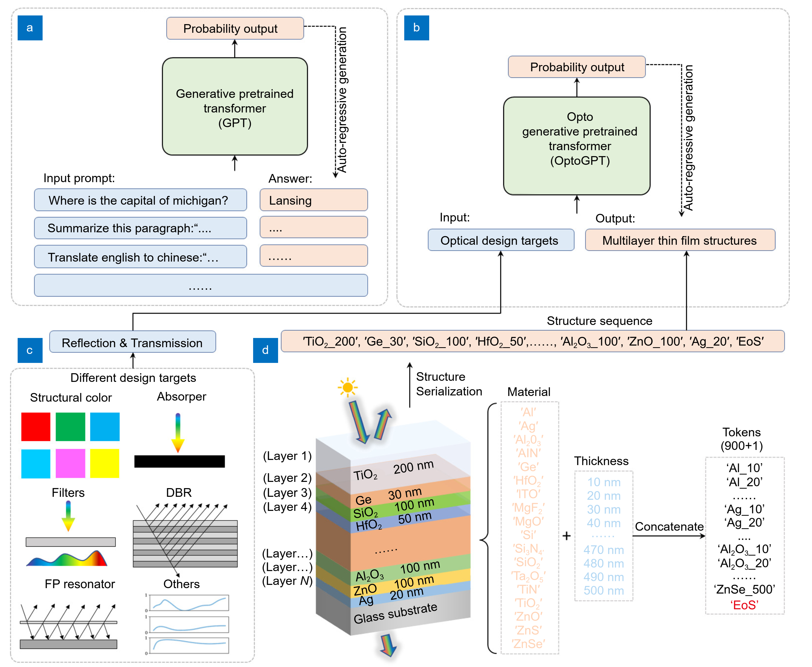

# Welcome to the OptoGPT Repo

This is the complete repo for three research works:

## OptoGPT: A foundation model for multilayer thin film inverse design
In this work, we introduce OptoGPT (Opto Generative Pretrained Transformer), a decoder-only transformer, to solve inverse design of multi-layer thin film structures. 

Check our paper at: https://www.oejournal.org/article/doi/10.29026/oea.2024.240062

The code can be found in folder **/optogpt**

## OL-Transformer: A Fast and Universal Surrogate Simulator for Optical Multilayer Thin Film Structures
In this work, we propose the Opto-Layer (OL) Transformer to act as a universal surrogate simulator for fast and efficient simulation of multilayer thin film structures.

Check our paper at: https://arxiv.org/abs/2305.11984

The code can be found in folder **/optogpt**

## Solving Out-of-Distribution Challenges in Optical Foundation Models using Self-Improving Data Augmentation
In this work, we propose a self-improving data augmentation technique by leveraging neural networks' extrapolation ability. Using this method, we show significant improvement in various real-applicative design tasks with minimum fine-tuning, which can also be potentially generalized to inverse scientific foundation models.

Check our paper at: https://openreview.net/forum?id=8jqhElTmNP 

The code can be found in folder **/self_improving**

## Citation
To cite this work:
~~~
@article{ma2024optogpt,
  title={OptoGPT: a foundation model for inverse design in optical multilayer thin film structures},
  author={Ma, Taigao and Wang, Haozhu and Guo, L Jay},
  journal={Opto-Electronic Advances},
  volume={7},
  number={7},
  year={2024},
  publisher={Opto-Electronic Advance}
}

@article{ma2023ol,
  title={OL-Transformer: A Fast and Universal Surrogate Simulator for Optical Multilayer Thin Film Structures},
  author={Ma, Taigao and Wang, Haozhu and Guo, L Jay},
  journal={arXiv preprint arXiv:2305.11984},
  year={2023}
}

@inproceedings{ma2024solving,
  title={Solving Out-of-Distribution Challenges in Optical Foundation Models using Self-Improving Data Augmentation},
  author={Ma, Mingqian and Ma, Taigao and Guo, L Jay},
  booktitle={Neurips 2024 Workshop Foundation Models for Science: Progress, Opportunities, and Challenges}
}
~~~