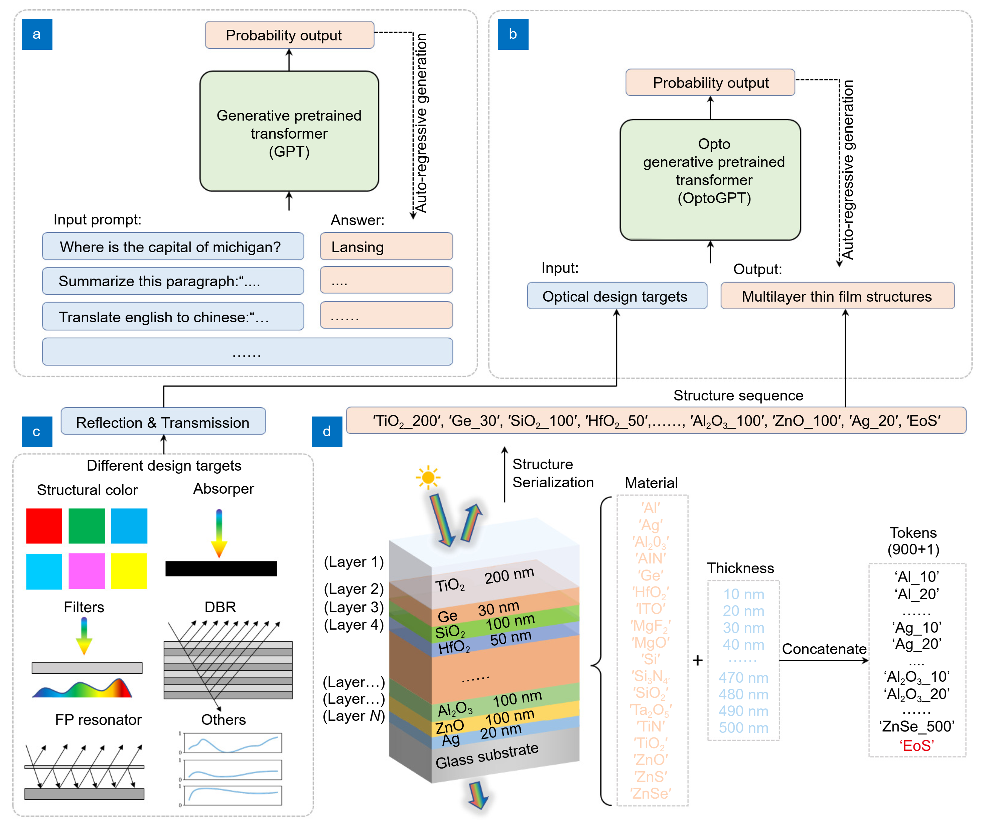
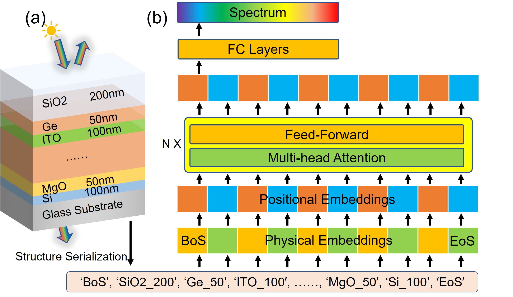
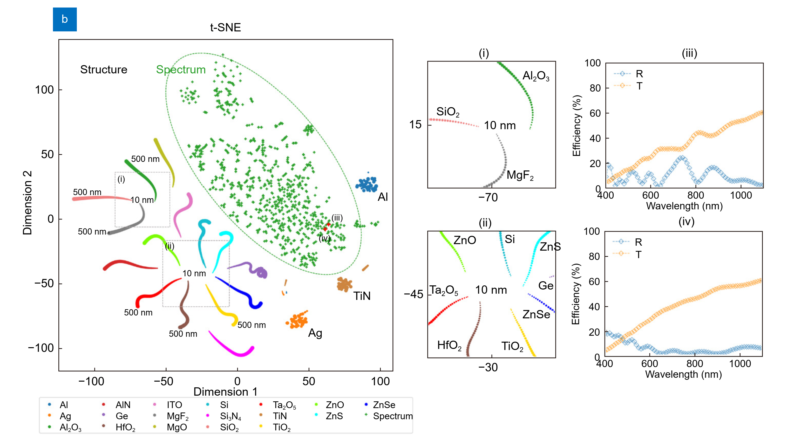
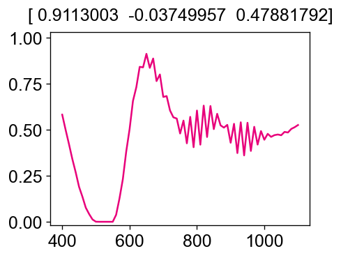

# README for OptoGPT & OL-Transforemr

## Project Overview

Optical multilayer thin film structures have been widely used in numerous photonic applications. However, existing inverse design methods have many drawbacks because they either fail to quickly adapt to different design targets, or are difficult to suit for different types of structures, e.g., designing for different materials at each layer. These methods also cannot accommodate versatile design situations under different angles and polarizations. In addition, how to benefit practical fabrications and manufacturing has not been extensively considered yet. In this work, we introduce OptoGPT (Opto Generative Pretrained Transformer), a decoder-only transformer, to solve all these drawbacks and issues simultaneously. 

Deep learning-based methods have recently been established as fast and accurate surrogate simulators for optical multilayer thin film structures. However, existing methods only work for limited types of structures with different material arrangements, preventing their applications towards diverse and universal structures. Here, we propose the Opto-Layer (OL) Transformer to act as a universal surrogate simulator for enormous types of structures. Combined with the technique of structure serialization, our model can predict accurate reflection and transmission spectra for up to $10^{25}$ different multilayer structures, while still achieving a six-fold degradation in simulation time compared to physical solvers. Further investigation reveals that the general learning ability comes from the fact that our model first learns the physical embeddings and then uses the self-attention mechanism to capture the hidden relationship of light-matter interaction between each layer.

Check our OptoGPT paper here: https://www.oejournal.org/article/doi/10.29026/oea.2024.240062

Check our OL-Transformer paper here: https://arxiv.org/abs/2305.11984

## Installation 

To set up the environment for this project, follow these steps:

### 1. Clone this repository
~~~
git clone https://github.com/taigaoma1997/optogpt.git

cd optogpt/optogpt
~~~

### 2. Create and activate a conda environment:
~~~
conda env create -f environment.yml
conda activate optogpt
~~~
## Environment Details 
The project uses the following key dependencies (full list in environment.yml)
~~~
python==3.8.19
datasets==2.17.0
numpy==1.23.4
torch==2.0.1
tmm==0.1.8
scikit-learn==1.2.1
pandas==1.5.1
matplotlib==3.7.5
seaborn==0.13.2
colour-science==0.4.1
~~~
## Dataset 

Please download our dataset and place it into this folder: https://huggingface.co/datasets/mataigao/optogpt_data

Then run data_conversion.ipynb to convert the .csv file to .pkl used for our loading function. 

## Model 

Please download our trained model here: https://huggingface.co/mataigao/optogpt

## Usage
To run the main training script:
~~~
CUDA_VISIBLE_DEVICES=0 python run_optogpt.py   # for OptoGPT
CUDA_VISIBLE_DEVICES=0 python run_ol_transformer.py   # for OL-Transformer
~~~
To do evaluations, please use the following files:
~~~
analysis_ol_transformer.ipynb  # analyze your trained OL-Transformer and reproduce paper results

analysis_optogpt.ipynb         # analyze your trained OptoGPT and reproduce paper results
~~~

## Color to spectrum conversion

We noticed that the color-to-spectrum algorithm could be helpful for the structural color research community. We also put the code here:
~~~
import numpy as np
from scipy.optimize import minimize
import matplotlib.pyplot as plt
from colour.difference import delta_E, delta_E_CIE2000
from colour import SDS_ILLUMINANTS, SpectralDistribution
from colour.colorimetry import MSDS_CMFS
illuminant = SDS_ILLUMINANTS['D65']
cmfs = MSDS_CMFS['CIE 1931 2 Degree Standard Observer']

TARGET = [0,  0.6, 0.6] 
TARGET_LAB = [50, 80, 0]

wavelengthss = np.arange(400, 1101, 10)

def get_rgb_from_spec(spec):
    wavelengthss = np.arange(400, 801, 10)
    data = dict(zip(wavelengthss, spec[:41]))
    sd = colour.SpectralDistribution(data, name='Sample')
    rgb = colour.convert(sd, 'Spectral Distribution', 'sRGB')
    return rgb

def get_color(spec):
    # return the xyY, RGB, LAB from spectrum
    wavelengthss = np.arange(400, 801, 10)
    data = dict(zip((wavelengthss).astype('int'), spec[:41]))
    sd = SpectralDistribution(data)
    XYZ = colour.sd_to_XYZ(sd, cmfs, illuminant)
    xyY = colour.XYZ_to_xyY(XYZ)
    Lab = colour.XYZ_to_Lab(XYZ / 100)
    RGB = colour.XYZ_to_sRGB(XYZ / 100)
    return Lab, RGB, xyY

def fitness(spec, MODE = 'DeltaE'):
    lab, rgb, xyy = get_color(spec)
    if MODE == 'DeltaE':
        mse = delta_E_CIE2000(lab, TARGET_LAB)
        smoothness = np.square(np.gradient(np.gradient(spec))).mean()
        return mse + 50*smoothness # you can change this alpha factor accordingly
    elif MODE == 'RGB':
        mse = np.mean(np.square(TARGET - rgb))
        smoothness = np.square(np.gradient(np.gradient(spec))).mean()
        return mse + 10*smoothness # you can change this alpha factor accordingly
    else:
        raise NotImplementedError

# color to spectrum conversion using optimization
np.random.seed(100)
x0 = np.random.rand((1100-400) // 10 + 1)
bounds = [[0, 1] for _ in range(len(x0))]
res = minimize(fitness, x0, method='SLSQP', options={'disp': True, 'maxiter':100, 'tol':1e-9}, bounds=bounds)

# calculate the performance of converted spectrum
spec_rgb = list(res.x)
lab2, rgb2, xyy2 = get_color(res.x)
mse = np.mean(np.abs(TARGET - rgb2))
deltae = delta_E_CIE2000(lab2, TARGET_LAB)
smoothness = np.abs(np.gradient(np.gradient(res.x))).mean()
print('Designed RGB:', rgb2, '\nDesigned LAB:', lab2, '\nTarget LAB:', TARGET_LAB, '\nelta E:', deltae, '\nColor MSE:', mse, '\nSpectrum Smoothness:', smoothness)

# plot the retrived spectrum
fig = plt.figure(dpi=120, figsize=[4, 3])
fig.patch.set_facecolor('white')
plt.plot(wavelengthss, res.x, color = np.clip(rgb2, 0, 1))
plt.title(rgb2)
plt.ylim(-0.020, 1.03)
plt.show()
~~~

## Project Structure
~~~
optogpt/optogpt/
|--- core/                      # core functions for OptoGPT and OL-Transformer
    |--- dataset/
        |--- datasets.py        # dataset preprocess
        |--- sim.py             # multilayer system simulation functions 
    |--- models                 # model architecture for OptoGPT and OL-Transformer
    |--- trains                 # Training algorithms
    |--- utils                  
        |--- cie-cmf.txt        # color matching function files
        |--- color_system.py    # helpful functions for color conversion
        |--- common.py          # maybe useful
|--- datasets/                  # please convert from .csv file to .pkl file 
    |--- Spectrum_train.pkl
    |--- Spectrum_dev.pkl
    |--- Structure_train.pkl
    |--- Structure_dev.pkl
|--- figures/                   # repo figures
|--- nk
    |--- multiple .csv files    # each file is a refractive index data we measured experimentally 
|--- optogpt_data               # please download it from huggingface 
|--- analysis_ol_transformer.ipynb  # analyze your trained OL-Transformer and reproduce paper results
|--- analysis_optogpt.ipynb         # analyze your trained OptoGPT and reproduce paper results
|--- data_conversion.ipynb       # data conversion from 
|--- environment.yml
|--- read_me.md
|--- run_ol_transformer.py
|--- run_optogpt.py
~~~

To cite this work:
~~~
@article{ma2024optogpt,
  title={OptoGPT: a foundation model for inverse design in optical multilayer thin film structures},
  author={Ma, Taigao and Wang, Haozhu and Guo, L Jay},
  journal={Opto-Electronic Advances},
  volume={7},
  number={7},
  year={2024},
  publisher={Opto-Electronic Advance}
}

@article{ma2023ol,
  title={OL-Transformer: A Fast and Universal Surrogate Simulator for Optical Multilayer Thin Film Structures},
  author={Ma, Taigao and Wang, Haozhu and Guo, L Jay},
  journal={arXiv preprint arXiv:2305.11984},
  year={2023}
}
~~~
